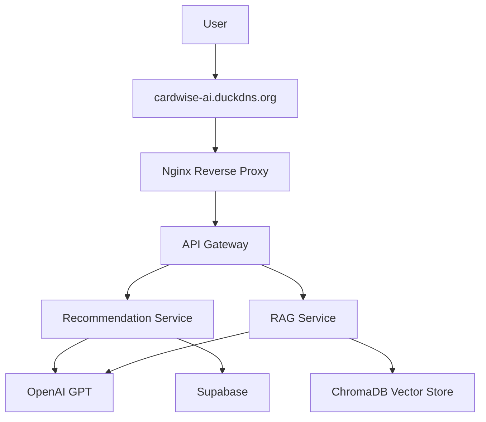
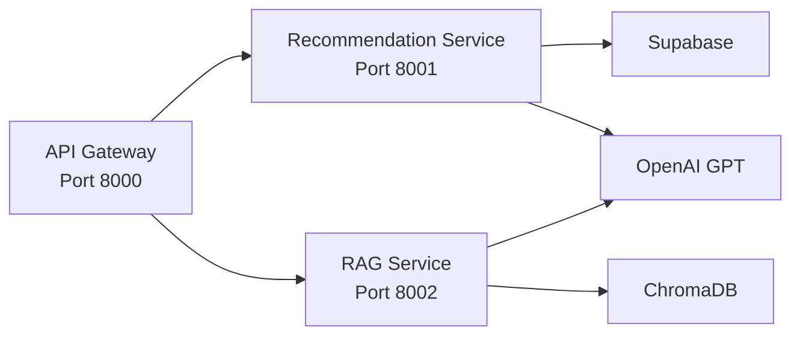
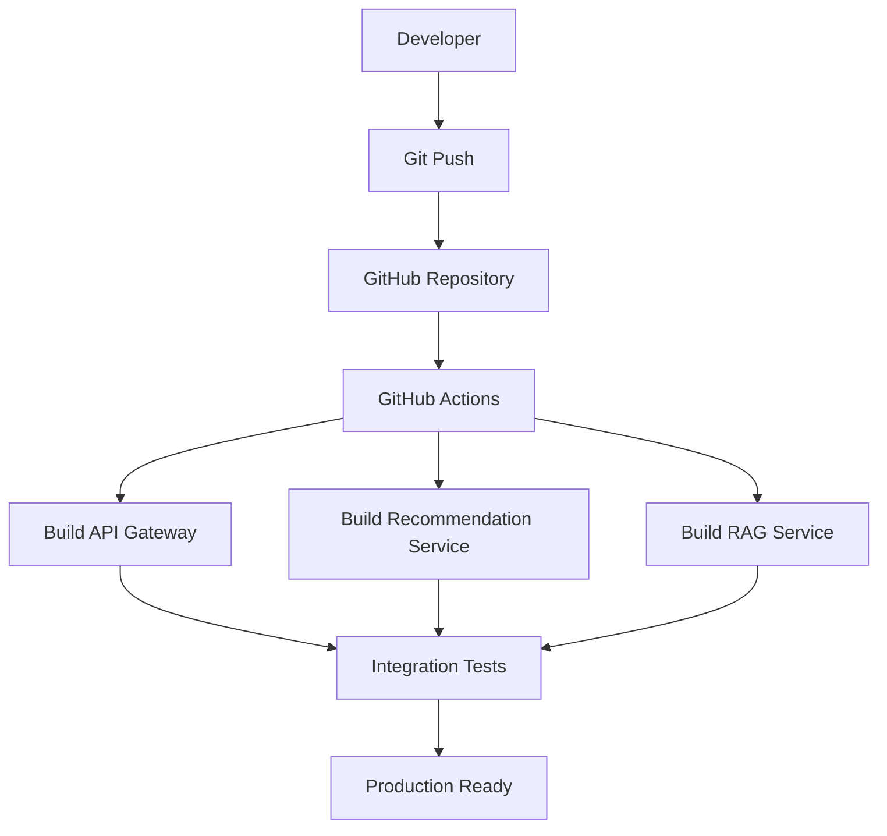
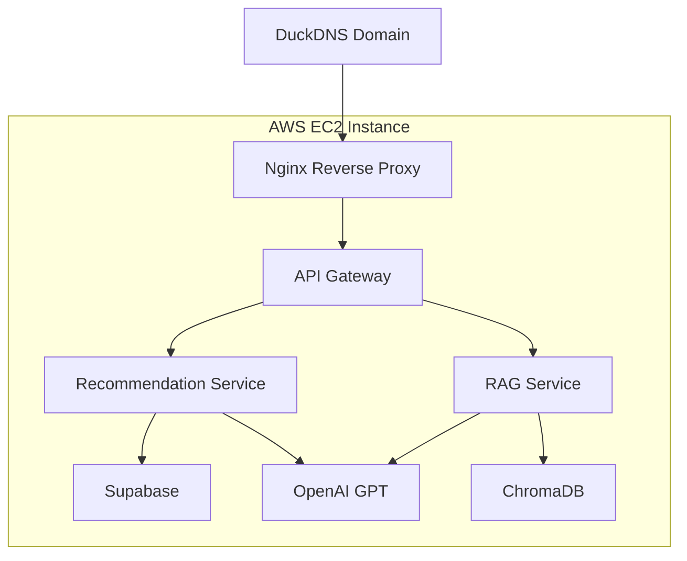
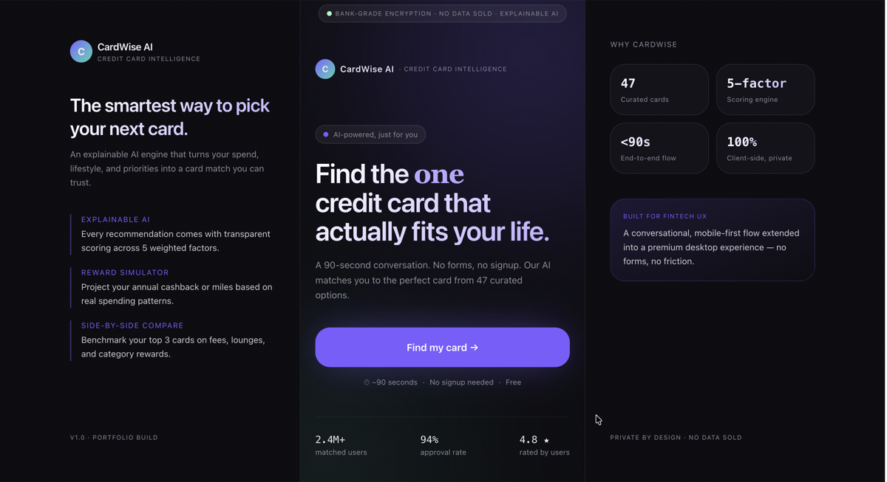
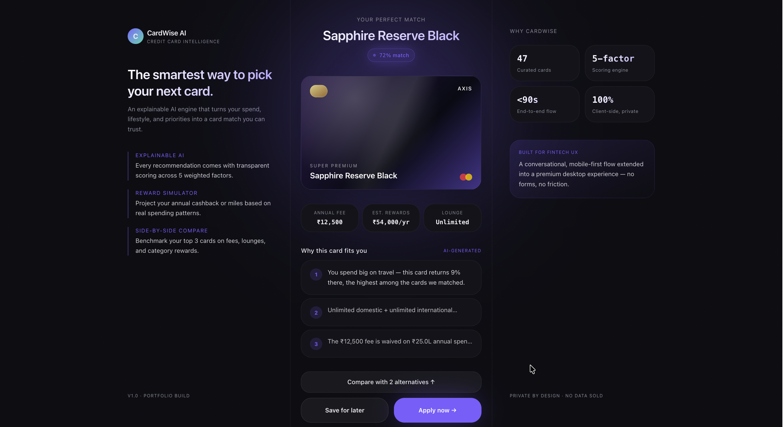
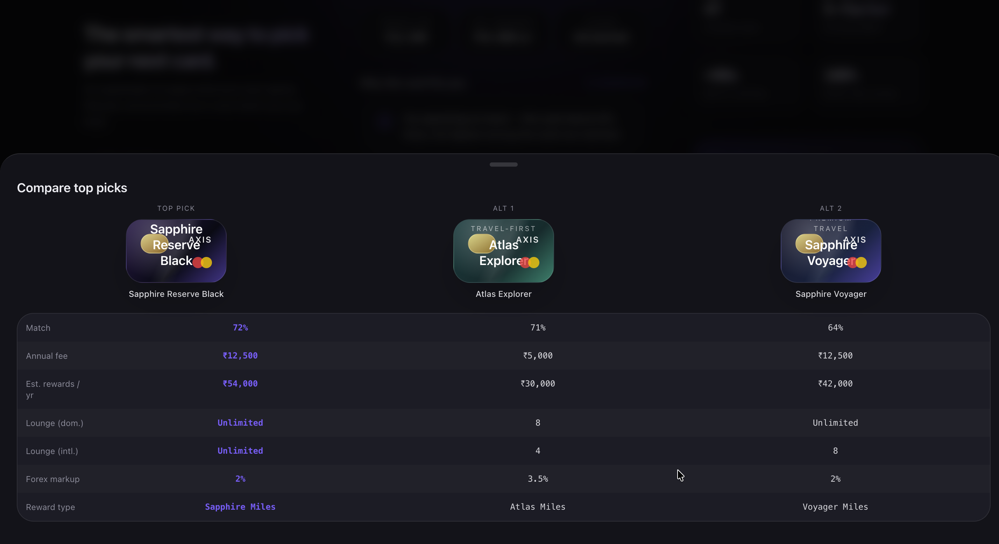
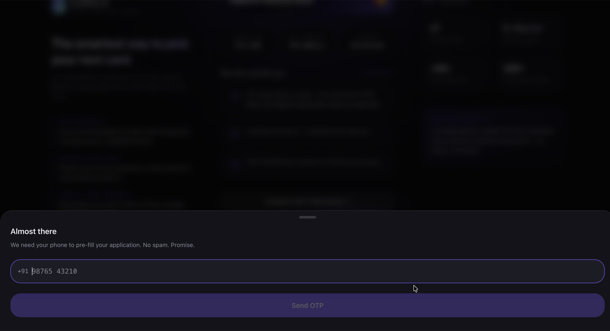
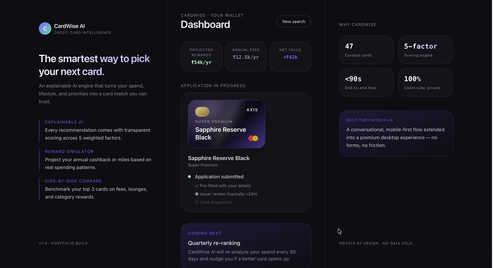

# CardWise AI Platform

AI-powered credit card recommendation platform built using FastAPI, OpenAI, Retrieval-Augmented Generation (RAG), Supabase, Docker, GitHub Actions, and AWS Microservices Architecture.

CardWise helps users discover the most suitable credit cards based on spending behavior, lifestyle preferences, annual fee tolerance, reward goals, and travel requirements. The platform combines recommendation algorithms, Large Language Models (LLMs), financial insights, and document intelligence to deliver explainable recommendations.

---

# Live Deployment

### Production URL

http://cardwise-ai.duckdns.org

### Health Endpoints

http://cardwise-ai.duckdns.org/health

http://cardwise-ai.duckdns.org/recommend-health

http://cardwise-ai.duckdns.org/rag-health

---

# Features

## Recommendation Engine

* Personalized credit card recommendations
* Multi-factor scoring and ranking
* Explainable recommendation reasoning
* Reward optimization suggestions
* Financial spending insights
* AI-generated recommendation explanations

## GenAI Layer

* OpenAI GPT integration
* Personalized financial guidance
* Context-aware recommendation generation
* Reward maximization recommendations

## Retrieval-Augmented Generation (RAG)

* PDF document ingestion pipeline
* OpenAI embeddings
* ChromaDB vector database
* Semantic search and retrieval
* Credit card policy question answering
* Knowledge-grounded responses

## Cloud & Infrastructure

* Dockerized microservices
* API Gateway architecture
* AWS EC2 deployment
* Nginx reverse proxy
* Elastic IP configuration
* GitHub Actions CI pipeline
* Public domain hosting

---

# System Architecture



---

# Microservices Architecture



---

# CI/CD Pipeline



---

# AWS Deployment Architecture



---

# Microservices

## API Gateway

Port: 8000

Responsibilities:

* Request routing
* Service orchestration
* Unified API interface
* Health monitoring

---

## Recommendation Service

Port: 8001

Responsibilities:

* Credit card ranking
* Recommendation generation
* OpenAI-powered explanations
* Financial insights generation
* Reward optimization analysis

---

## RAG Service

Port: 8002

Responsibilities:

* Vector similarity search
* PDF knowledge retrieval
* Semantic document search
* Credit card policy Q&A
* Knowledge-grounded responses

---

# Tech Stack

## Frontend

* React
* TypeScript
* Vite
* Tailwind CSS
* Framer Motion
* Zustand

## Backend

* FastAPI
* Python
* Pydantic
* REST APIs

## AI & Data

* OpenAI GPT-4o
* OpenAI Embeddings
* Retrieval-Augmented Generation (RAG)
* ChromaDB
* Supabase

## Infrastructure

* Docker
* Docker Compose
* GitHub Actions
* Nginx
* AWS EC2
* Ubuntu Linux
* Elastic IP
* DuckDNS

---

# AWS Deployment

Production Infrastructure:

* AWS EC2 Ubuntu Server
* Docker Compose Orchestration
* Nginx Reverse Proxy
* Elastic IP
* DuckDNS Domain

Production Services:

* API Gateway
* Recommendation Service
* RAG Service

Deployment Model:

```text
Internet
↓
DuckDNS Domain
↓
Nginx Reverse Proxy
↓
API Gateway
↓
Recommendation Service + RAG Service
↓
OpenAI + Supabase + ChromaDB
```

---

# API Endpoints

## Health Check

```http
GET /health
```

---

## Recommendation API

```http
POST /recommend
```

Example Request:

```json
{
  "categories":["travel"],
  "monthly_spend":50000,
  "priority":"rewards",
  "fee_tolerance":"medium",
  "income":"12to25"
}
```

---

## RAG API

```http
POST /rag
```

Example Request:

```json
{
  "question":"What lounge access benefits does HDFC Regalia Gold provide?"
}
```

---

# Project Structure

```text
cardwise-ai-platform/

├── frontend/
│
├── backend/
│
├── services/
│   ├── api-gateway/
│   ├── recommendation-service/
│   └── rag-service/
│
├── .github/
│   └── workflows/
│
├── docker-compose.yml
│
├── screenshots/
│
└── README.md
```

---

# Screenshots

### Landing Page



### Recommendation Engine



### Compare Cards



### OTP Flow



### Dashboard



---

# Local Development

Clone Repository

```bash
git clone https://github.com/ajaysathriai-afk/cardwise-ai-platform.git
```

Start Application

```bash
docker compose up --build
```

---

# Achievements

* Built end-to-end AI-powered fintech platform
* Implemented Retrieval-Augmented Generation (RAG)
* Designed microservices architecture using FastAPI
* Integrated OpenAI GPT for recommendation explainability
* Built vector search pipeline using ChromaDB
* Configured GitHub Actions CI pipeline
* Containerized services using Docker and Docker Compose
* Deployed production workloads on AWS EC2
* Configured Nginx reverse proxy and public domain routing

---

# Future Enhancements

* Automated GitHub → AWS deployment
* HTTPS SSL certificates
* Monitoring and observability
* User authentication
* Usage analytics dashboard
* Credit score integration
* Multi-bank product support

---

# Author

### Ajay Kumar Sathri

AI Engineer | Data Science | GenAI | Full Stack Development

GitHub:

https://github.com/ajaysathriai-afk
deploy test
