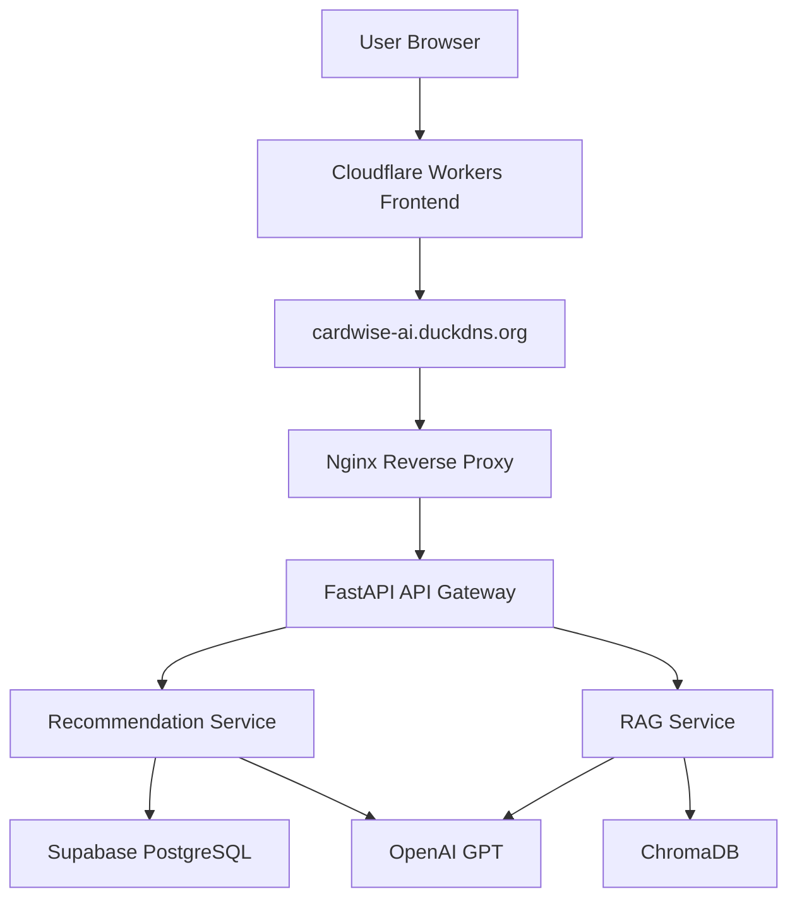
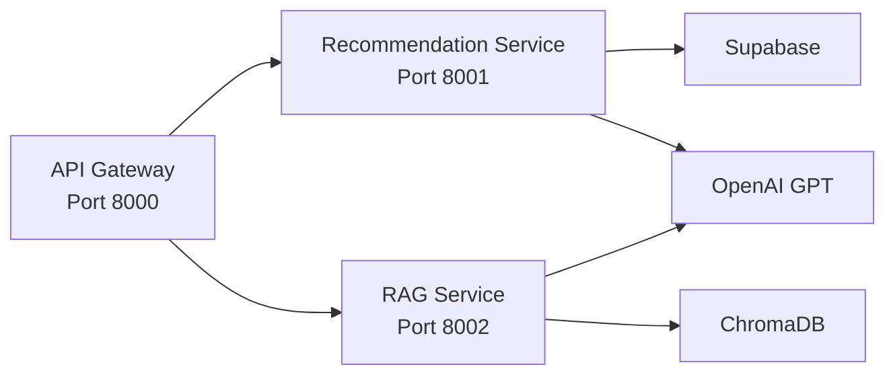
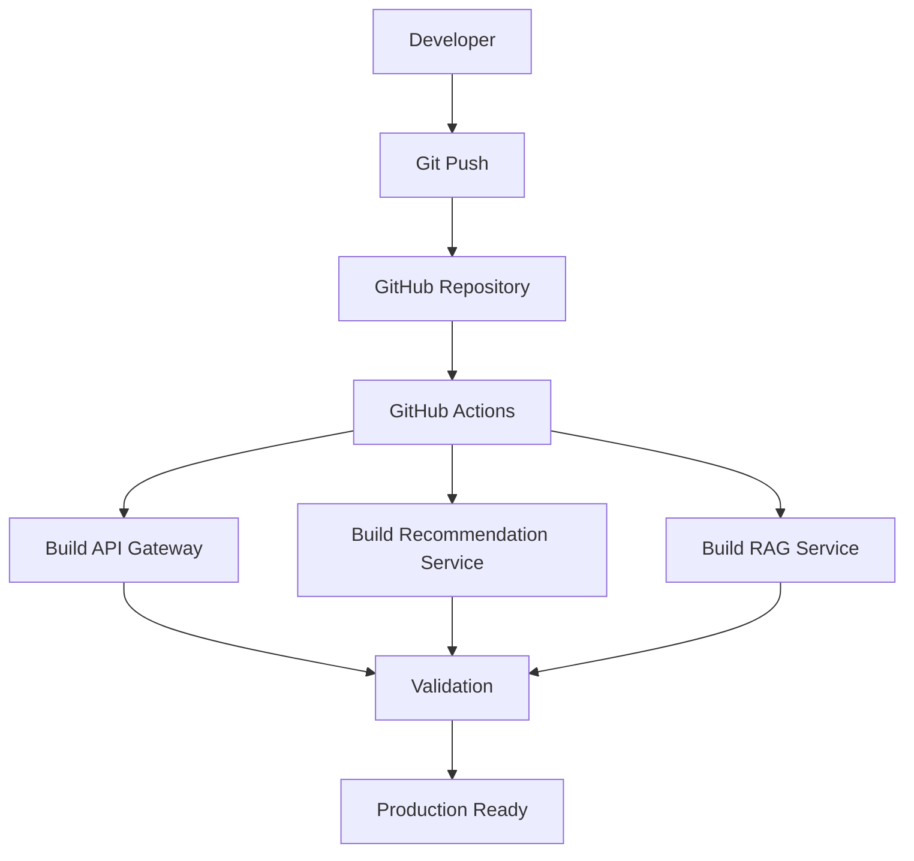
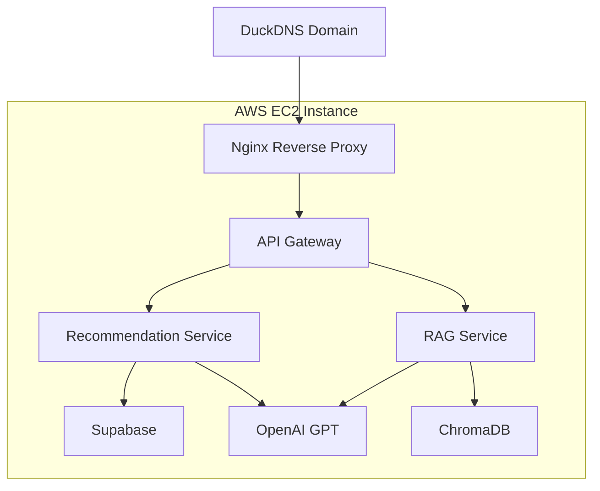

# CardWise AI Platform

AI-powered credit card recommendation platform built using React, FastAPI, OpenAI, Retrieval-Augmented Generation (RAG), Supabase (PostgreSQL), ChromaDB, Docker, GitHub Actions, Cloudflare, Nginx, and AWS Microservices Architecture.

CardWise AI helps users discover the most suitable credit cards based on spending behavior, lifestyle preferences, annual fee tolerance, reward goals, and travel requirements. The platform combines recommendation algorithms, financial insights, reward optimization, vector search, and AI-powered knowledge retrieval to deliver explainable recommendations.

---

# Live Deployment

## Frontend

https://tanstack-start-app.ajaysathri-ai.workers.dev

## Backend API

https://cardwise-ai.duckdns.org

## Health Endpoints

https://cardwise-ai.duckdns.org/health

https://cardwise-ai.duckdns.org/recommend-health

https://cardwise-ai.duckdns.org/rag-health

## GitHub Repository

https://github.com/ajaysathriai-afk/cardwise-ai-platform

---

# Features

## Recommendation Engine

* Personalized credit card recommendations
* Multi-factor scoring and ranking
* Explainable recommendation reasoning
* Reward optimization suggestions
* Financial spending insights
* AI-generated recommendation explanations
* Estimated annual rewards calculation

---

## GenAI Layer

* OpenAI GPT integration
* Personalized financial guidance
* Context-aware recommendation generation
* Reward maximization recommendations
* AI-powered recommendation explanations

---

## Retrieval-Augmented Generation (RAG)

* PDF document ingestion pipeline
* OpenAI embeddings
* ChromaDB vector database
* Semantic search and retrieval
* Credit card policy question answering
* Knowledge-grounded responses
* Financial knowledge assistant

---

## Cloud & Infrastructure

* Dockerized microservices architecture
* API Gateway architecture
* AWS EC2 deployment
* Nginx reverse proxy
* Elastic IP configuration
* GitHub Actions CI/CD
* Cloudflare frontend deployment
* Public domain hosting
* Production logging
* Health monitoring endpoints
* Service observability

---

# System Architecture



---

# Microservices Architecture



---

# CI/CD Pipeline



---

# AWS Production Architecture



---

# Monitoring & Reliability

## Monitoring

* Health monitoring endpoints
* Service status monitoring
* Docker service visibility
* Production deployment validation

## Logging

* API Gateway request logging
* Recommendation service logging
* RAG service logging
* Docker container logs

## Reliability

* Docker restart policies
* Health checks
* Service recovery support
* Production deployment hardening

## Observability

* Easier debugging
* Service-level monitoring
* Request tracing through microservices
* Production troubleshooting support

---

# Microservices

## API Gateway

Port: 8000

Responsibilities:

* Request routing
* Service orchestration
* Unified API interface
* Health monitoring
* Cross-service communication

---

## Recommendation Service

Port: 8001

Responsibilities:

* Credit card ranking
* Recommendation generation
* Financial insights generation
* Reward optimization analysis
* AI-powered explanations

---

## RAG Service

Port: 8002

Responsibilities:

* Vector similarity search
* PDF knowledge retrieval
* Semantic document search
* Credit card policy Q&A
* Knowledge-grounded responses

---

# Tech Stack

## Frontend

* React
* TypeScript
* Vite
* Tailwind CSS
* Framer Motion
* Zustand
* Cloudflare Workers

---

## Backend

* FastAPI
* Python
* Pydantic
* REST APIs

---

## AI & Data

* OpenAI GPT
* OpenAI Embeddings
* Retrieval-Augmented Generation (RAG)
* Supabase (PostgreSQL)
* pgvector
* ChromaDB

---

## Infrastructure

* Docker
* Docker Compose
* GitHub Actions
* Nginx
* AWS EC2
* Ubuntu Linux
* Elastic IP
* DuckDNS

---

# Production Deployment

## Infrastructure

* AWS EC2 Ubuntu Server
* Docker Compose Orchestration
* Nginx Reverse Proxy
* Elastic IP
* DuckDNS Domain
* Cloudflare Frontend Hosting

## Production Services

* API Gateway
* Recommendation Service
* RAG Service

## Deployment Flow

```text
User Browser
↓
Cloudflare Frontend
↓
DuckDNS Domain
↓
Nginx Reverse Proxy
↓
API Gateway
↓
Recommendation Service + RAG Service
↓
Supabase + OpenAI + ChromaDB
```

---

# API Endpoints

## Health Check

```http
GET /health
```

## Recommendation API

```http
POST /recommend
```

Example Request:

```json
{
  "categories": ["travel"],
  "monthly_spend": 50000,
  "priority": "rewards",
  "fee_tolerance": "medium",
  "income": "12to25"
}
```

## RAG API

```http
POST /rag
```

Example Request:

```json
{
  "question": "What lounge access benefits does HDFC Regalia Gold provide?"
}
```

---

# Project Structure

```text
cardwise-ai-platform/

├── frontend/
├── backend/
├── services/
│   ├── api-gateway/
│   ├── recommendation-service/
│   └── rag-service/
├── .github/
│   └── workflows/
├── docker-compose.yml
├── screenshots/
└── README.md
```

---

# Key Achievements

* Built an end-to-end AI-powered fintech recommendation platform
* Designed and implemented FastAPI microservices architecture
* Developed a Retrieval-Augmented Generation (RAG) pipeline using OpenAI Embeddings and ChromaDB
* Integrated Supabase (PostgreSQL) for credit card data management
* Built semantic search and knowledge retrieval capabilities for credit card policy assistance
* Containerized services using Docker and Docker Compose
* Implemented GitHub Actions CI/CD workflows
* Deployed production workloads on AWS EC2
* Configured Nginx reverse proxy and public domain routing
* Integrated Cloudflare frontend deployment
* Implemented monitoring, logging, health checks, and service observability
* Resolved real-world deployment challenges involving CORS, HTTPS, reverse proxies, container networking, Docker orchestration, and frontend-backend integration

---

# Future Enhancements

* User authentication and authorization
* Credit score integration
* Real-time bank offer ingestion
* Advanced analytics dashboard
* Usage tracking and insights
* Multi-bank product support
* Rate limiting and API security
* Advanced monitoring and observability dashboards
* Automated GitHub-to-AWS deployment pipeline
* Custom .com domain

---

# Project Status

## CardWise AI v1.0

✅ Production Deployed

✅ End-to-End Functional

✅ Cloud Hosted

✅ Portfolio Ready

✅ CI/CD Enabled

✅ Monitoring & Logging Enabled

---

# Author

### Ajay Kumar Sathri

AI Engineer | Data Science | Generative AI | Full Stack Development

GitHub:

https://github.com/ajaysathriai-afk
